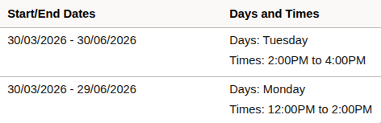

<div align="center">
  
  <h1>Schedulr</h1>
  <p>A chrome extension that transfers MMU timetable into Google, Outlook, Apple Calendar (and more)</p>

[](https://github.com/sycanz/schedulr/blob/main/LICENSE)
[](https://github.com/sycanz/schedulr/releases)

</div>

https://github.com/user-attachments/assets/4ee6a69a-cfb0-42d7-abf2-63661013a642

## Table of Content

- [Requirements](https://github.com/sycanz/schedulr?tab=readme-ov-file#requirements-)
- [Where to get help or support?](https://github.com/sycanz/schedulr?tab=readme-ov-file#where-can-i-get-any-help-or-support)
- [Installation](https://github.com/sycanz/schedulr?tab=readme-ov-file#installation-)
- [Usage](https://github.com/sycanz/schedulr?tab=readme-ov-file#usage-%EF%B8%8F)
    - [Import timetable into Google Calendar](https://github.com/sycanz/schedulr?tab=readme-ov-file#to-import-calendar-into-google-calendar)
    - [Import timetable into other calendars](https://github.com/sycanz/schedulr?tab=readme-ov-file#to-import-calendar-into-other-calendars-like-outlook-apple-calendar)
- [Project status](https://github.com/sycanz/schedulr?tab=readme-ov-file#project-status-)
- [Contributing](https://github.com/sycanz/schedulr?tab=readme-ov-file#contributing-)
- [Development Guide](https://github.com/sycanz/schedulr?tab=readme-ov-file#development-guide-)
    - [Testing on Staging](https://github.com/sycanz/schedulr?tab=readme-ov-file#testing-on-staging-for-developers)
- [Tech Stack](https://github.com/sycanz/schedulr?tab=readme-ov-file#tech-stack-)
- [Changelog](https://github.com/sycanz/schedulr?tab=readme-ov-file#changelog-)
- [Privacy policy](https://github.com/sycanz/schedulr?tab=readme-ov-file#privacy-policy-)
- [License](https://github.com/sycanz/schedulr?tab=readme-ov-file#license-%EF%B8%8F)
- [Why this project?](https://github.com/sycanz/schedulr?tab=readme-ov-file#why-this-project-)
- [Buy me a coffee](https://github.com/sycanz/schedulr?tab=readme-ov-file#buy-me-a-coffee-)
- [Credit](https://github.com/sycanz/schedulr?tab=readme-ov-file#credit-)
- [Frequently Asked Questions (FAQs)](https://github.com/sycanz/schedulr?tab=readme-ov-file#frequently-asked-questions-faqs-)

## Requirements 👀

- MMU students with **"Active"** current student status **ONLY**, MMU Lecturers.
- Chromium-based browser or Firefox **ONLY**. (Safari might not work as intended)

## Where can I get any help or support?

Check if the encountered issues are mentioned in this documentation. If not, you can communicate with me through [email](mailto:aidenchan0397@gmail.com), [issue tracker](https://github.com/sycanz/schedulr/issues), or [discord](https://discordapp.com/users/340443368326692876).

## Installation 📦

1. Go to the [extension's page](https://chromewebstore.google.com/detail/schedulr/ofaflpillnejkhmkefmcpoamjeaghipp) or search up "Schedulr" in Chrome Web Store.
2. Click "Add to Chrome".

## Usage 🕹️

Note: Some steps after step 4 may vary depending on your target calendar.

#### For students:

1. Go to **"View My Classes/Schedule > By Class"** in CliC. **_(Ensure all subjects are expanded)_**

#### For lecturers:

1. Go to **"Instructor WorkCenter > My Weekly Schedule"** in CLiC.

---

2. Open the extension by using the [shortcut key](https://github.com/sycanz/schedulr?tab=readme-ov-file#key-binding-) or by clicking the extension icon.
3. An authentication window will appear, grant permission for both scopes and then reopen the extension.

---

#### To import calendar into Google Calendar:

4. Select **Transfer to Google Calendar**, then click **Confirm**.
5. Select all the necessary options.
6. Press the **Submit** button to transfer timetable to Google Calendar.

---

#### To import calendar into other calendars (like Outlook, Apple Calendar):

4. Select **Download an .ics file**, then click **Confirm**.
5. Select all the necessary options.
6. Press the **Submit** button to download the .ics file.
7. Go to your target calendar and import the .ics file.

**\*Tip**: An .ics file lets you import events into other calendar apps like Outlook.\*

## Project status ⏳

Schedulr version 4.1.0 is available on [Chrome Web store](https://chromewebstore.google.com/detail/schedulr/ofaflpillnejkhmkefmcpoamjeaghipp) as of now.

## Contributing 🤝🏻

Schedulr is an open-source project designed to assist fellow MMU peers. I invite you to participate in various ways to contribute and enhance the project!

Feel free to explore the [contribution guidelines](https://github.com/sycanz/schedulr/blob/main/.github/CONTRIBUTING.md) below to get started. Your involvement is greatly appreciated!

## Development Guide 📚

### Prerequisites

You should be familiar with or have a basic understanding of these:

- HTML, CSS, Javascript
- Web Scraping
- Google Calendar API
- Cloudflare Workers
- Github action / Rollup (recommended in case you need to fix build processes)
- Chrome extension development, manifest v3.

### Understanding the Project

#### System Architecture


#### Project Structure

```
├── backend                     # contains backend (cloudflare worker, supabase) code
│   ├── cloudflare-workers      # cloudflare worker code and configs
│   │   ├── dist/               # stores cfw post built (distribution) files
│   │   ├── package.json        # packages installed in cfw
│   │   ├── README.md
│   │   ├── src                 # all cfw code
│   │   │   ├── index.ts        # main file to handle cfw endpoints
│   │   │   └── lib/            # stores reusable functions
│   │   ├── tsconfig.json
│   │   ├── .dev.vars           # environment variables for cfw (development)
│   │   ├── .dev.vars.prd       # environment variables for cfw (production)
│   │   └── wrangler.jsonc      # wrangler config
│   └── db/                     # database code
├── docs/                       # product website code
├── frontend/                   # extension's client side functions
│   ├── dist/                   # stores extension post built (distribution) file
│   └── src                     # all extension code
│       ├── backgrounds/        # background (service worker) script
│       ├── popup/              # stores extension popup related code
│       └── scripts             # reusable functions
│           ├── auth/           # authentication flow functions
│           ├── calendar/       # google calendar functions
│           ├── scraper/        # web scraping functions
│           └── utils/          # misc reusable functions
├── images/                     # images used for schedulr
├── package.json                # package manager config
├── package-lock.json           # package lock file
├── rollup.config.js            # rollup config file
├── Makefile                    # shortcut commands for building extension
├── .env                        # environment variables for frontend
└── manifest.json               # extension manifest file
```

#### Program Flow

The sequence diagram below illustrates both the authentication and import to calendar process in Schedulr:


#### Entity Relationship Diagram

In this schema, we treat each account as separate user despite being logged in from the same IP.


The relationship between each table are:

1. users (one) - oauth_tokens (one): each user can have only one oauth token
2. users (one) - sessions (one): each user can have only one session

> [!NOTE]
> To clarify, each user can only have one oauth_tokens and sessions is because the program upserts (overwrites) previous oauth token and session when user logs in again. You can refer to [backend/db/schema.sql](https://github.com/sycanz/schedulr/blob/main/backend/db/schema.sql) for the table definitions.

#### Secret Management

Project secrets are stored as GitHub secrets and injected as environment variables during build time.

#### Build Process

The build process is handled by GitHub Actions:


### Getting Started

**Note**: This guide is based on Google Chrome's workflow, so some of the steps _(especially `manifest.json` format)_ may not directly apply to other browsers. Please refer to the respective browser's documentation for more information.

#### Uploading the extension to your browser

1. **Clone the Repository**

    ```bash
    git clone https://github.com/sycanz/schedulr
    ```

2. **Load the Extension into Chrome**
    - Open Chrome browser and go to `chrome://extensions/`
    - Enable Developer mode (toggle switch at the top right)
    - Click on `Load unpacked` and select the cloned repository
    - The extension should now be loaded in your browser

    **IMPORTANT**: Take note of the Client ID (Item ID) of the extension, you'll need it for setting up the Google Calendar API.

#### Testing on Staging (for Developers)

To test the latest changes before they are merged into production:

1. Once you have changes, create a PR to the `stg` branch.
2. Wait for the CI and CD pipelines to complete on GitHub Actions.
3. Download `schedulr-chrome-stg-zip` for Chrome or `schedulr-firefox-stg-zip` for Firefox from the **Artifacts** section at the bottom.
4. Load in Browser:
    - **Chrome**: Unzip and use `Load unpacked` in `chrome://extensions/`.
    - **Firefox**: Go to `about:debugging#/runtime/this-firefox`, click `Load Temporary Add-on...`, and select zipped Firefox build.
5. Test the extension functionality. The staging environment uses separate Cloudflare Worker endpoints and secrets to ensure isolation.
6. After validation is successful, the code owner (sycanz/Aiden) will handle the final merge to the `main` branch for production deployment.

#### Setting up Google Calendar API

1. Create a new project in the Google Cloud Console.
2. Enable the Google Calendar API.
3. Generate an OAuth 2.0 credentials (OAuth Client ID) with the application type **Web application**, add the following authorised redirect URIs:
    - `https://<YOUR-APP-ID>.chromiumapp.org/oauth`
4. Retrieve the **Client ID** and **Client Secret**.

#### Setup development environment

1. Run `npm run setup` in the root directory to install all dependencies.
2. Create `.env` file (frontend secrets) in the **root** directory and add the necessary variables by referring to [.env.example](https://github.com/sycanz/schedulr/blob/main/.env.example).

3. Create `.dev.vars` file (backend secrets) in **backend/cloudflare-workers/** directory and add the necessary variables by referring to [.dev.vars.example](https://github.com/sycanz/schedulr/blob/main/backend/cloudflare-workers/.dev.vars.example).

### Development Tips

#### Backend development (Cloudflare Workers)

There's 2 ways to develop and test cloudflare worker:

1. Local development (recommended for development)
    - Open terminal 1 in project root dir, run `npm run watch:scraper` (helps read new changes to cfw files) or just run `npm run build:scraper` to build the scraper
    - Open terminal 2 in `backend/cloudflare-workers/`, run `npm run dev` (runs cfw locally)

    **NOTE**: This method requires you to edit the cfw endpoint to `http://localhost:8787` instead of the url provided in template above.

2. Push to dev/stg environment (recommended for staging/production testing)
    - **Custom Environment**: If you want your own cloudflare-hosted dev environment, add a new entry to the `env` object in [backend/cloudflare-workers/wrangler.jsonc](file:///home/sycanz/projects/schedulr/backend/cloudflare-workers/wrangler.jsonc).
    - **Automated Staging**: Alternatively, just use `localhost:8787` for local polish and then create a PR to the `stg` branch. When merged, the CI/CD pipeline will automatically inject the staging/production keys and deploy to the respective Cloudflare Workers. You can then test the extension by uploading to your browser as described in the [Testing on Staging](#testing-on-staging-for-developers) section.
    - **Manual Deploy**: Use makefile command `make deploy-dev` or `make deploy-stg` (requires `npx wrangler login`).

### Git Hooks (pre-commit)

During commit, Husky is setup to automatically:

1. Prettify code with prettier
2. Run linter with eslint

#### Manual Execution

- `npm run lint` to run the linter.
- `npm run lint:fix` to run the linter and fix issues.
- `npm run prettier` to run prettier.
- `npm run prettier:fix` to run prettier and fix issues.

## Tech Stack 🚀

1. Javascript
2. Google Calendar API (GCP)
3. Cloudflare Workers (Backend API)
4. Supabase (Database & Auth)
5. Rollup (Module Bundling)
6. GitHub Actions (CI/CD)
7. HTML, CSS

## Changelog 📁

Detailed changes for each release are documented in the [release notes](https://github.com/sycanz/schedulr/releases).

## Privacy policy 📜

Please read the [Privacy Policy](https://www.mmuschedulr.com/privacy-policy.html) for this extension before proceeding.

## License ⚖️

This project is licensed under the GNU General Public License v3.0 - see the [LICENSE](https://github.com/sycanz/schedulr/blob/main/LICENSE)

## Support ☕

If you've found this useful and want to support the project, you can send a TNG donation via the QR code below!

<div align="center">
  
</div>

## What is Defected CLiC?

CLiC (MMU's student portal) sometimes shows incorrect start dates for classes. Even if the actual class day is a Tuesday, CLiC might show the preceding Monday as the start date.



As shown in the image above, the start date is listed as **30/03/2026** (Monday), but the day on the right clearly states **Tuesday** (which would be 31/03/2026).

If you notice this discrepancy in your timetable, select **"Yes"** for **"Defected CLiC?"** in the extension. This ensures that Schedulr correctly calculates the first class date based on the day of the week rather than the potentially incorrect start date provided by CLiC.

## Credit 🎉

This project was developed at [Hackerspace MMU](https://hackerspacemmu.rocks/). Also shoutout to a couple of friends who helped me out on this project.

## Frequently Asked Questions (FAQs) 🤔

**Q: What browser does Schedulr currently support?**

**A:** Google Chrome, Chromium-based browsers (Brave, Edge, etc.), and Firefox. (Safari is not fully supported yet)

**Q: Do I have to pay for this extension?**

**A:** No, Schedulr is free to use for all **active** MMU students/lecturers and open-source.

**Q: Why are some of my classes not showing up in the timetable?**

**A:** Ensure you have expanded all subjects in the "By Class" page.

**Q: Do I need to grant permission every time I open the extension?**

**A:** No. Once you've granted permission, your session will remain active for **30 minutes** without needing to re-authenticate. This is by design to prevent session hijacking.

**Q: Should I be worried about my privacy when using this extension?**

**A:** No, the extension only reads your timetable and transfers it to your calendar. It does not store any personal data.

**Q: Can I use this extension for other universities?**

**A:** No, this extension is specifically designed for MMU students and lecturers only.

**Q: Are there any plans to support other browsers?**

**A:** Firefox is now officially supported! We are working on refining the experience. Safari is on the roadmap but not currently a priority.

**Q: Can I rely on this extension for my timetable?**

**A:** Somewhat, reason being CLiC might have unexpected bugs or changes that might affect the extension.

**Q: How can I contribute to this project?**

**A:** There are things like bug fixes, feature requests, code, and documentation that you can contribute to. Check out the [contribution guidelines](https://github.com/sycanz/schedulr/blob/main/.github/CONTRIBUTING.md)

**Q: Where can I get any help or support?**

**A:** Check if the encountered issues are mentioned in this documentation. If not, you can communicate with me through [email](mailto:aidenchan0397@gmail.com), [issue tracker](https://github.com/sycanz/schedulr/issues), or [discord](https://discordapp.com/users/340443368326692876)
